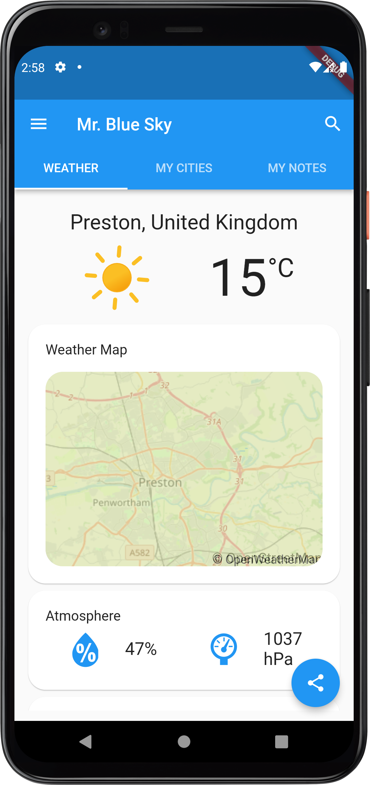

# Mr. Blue Sky

Air Quality and Weather monitoring mobile application.

Built with [Flutter][flutter].

## Features

This app fetches data from the [IQAir](https://iqair.com) API.

- Search through all the countries and cities available in the IQAir API
- Save cities as favourites and view them later
- View weather and air quality information for any city
  - Weather Map
  - Temperature
  - Humidity
  - Atmospheric Pressure
  - Air Quality Index
  - Wind Speed and Direction
- Share information about the weather
- Create, edit, remove, and share observations
- Sort your favourite cities and notes as you wish
- Arrange the weather information cards to your liking
- Sign up with your Google account and sync your data to the [Firebase](https://firebase.google.com/) cloud

## Design

#### Wireframe

[View at Figma](https://www.figma.com/file/LKPliorO1q8MNSVMx40d6x/Prototype?node-id=51139%3A674)

#### Prototype

[Interact with the prototype at Figma](https://www.figma.com/proto/LKPliorO1q8MNSVMx40d6x/Prototype?node-id=51100%3A5052&scaling=min-zoom&page-id=47909%3A2&starting-point-node-id=51100%3A5052)

##### Bibliography

- Material Design, 2022. *Design*. [online] Available at: \<https://material.io/design> [Accessed March 2022].

​			The official Material Design guidelines, which describe the ways widgets are intended to be used in mobile apps using this design paradigm.

- Norman, D., 2013. *The design of everyday things: Revised and expanded edition*. Basic books.

- Nielsen, J., 1994. *Usability engineering*. Morgan Kaufmann.
  - Jakob Nielsen makes an in-depth analysis of why usability is often overlooked in Software Engineering, and why it ought to be taken more seriously. Then, he offers quality advice on how to improve usability in different interfaces, and presents various design and testing techniques. Amongst these, the 10 usability heuristics are perhaps the most studied and utilised.
- Khamaj, A., Kang, Z. and Argyle, E., 2019, November. Users’ perceptions of smartphone weather applications’ usability. In *Proceedings of the Human Factors and Ergonomics Society Annual Meeting* (Vol. 63, No. 1, pp. 2216-2220). Sage CA: Los Angeles, CA: SAGE Publications.
  - Khamaj, et al. surveyed a focus group of undergraduate students ranging from 18  to 47 years old about weather app design patterns and usability. The survey included 9 questions about their preferences, past experiences, and general opinions about certain design elements in weather apps. Using thematic analysis, four major themes were identified in the participants' responses. These themes were: *User Cognitive Load*, *Effectiveness*, *Efficiency of Use*, and *User Perceptions*. Participants concurred in making features easily reachable, through effective signalling and labelling. Several participants argued that information should be easily digestible, without technical jargon, and concise enough to comfortably fit in the screen. Flexibility in the ways to accomplish a task was a desired feature by many. For the most part, the findings were found to align with Nielsen's heuristics. The final three recommendations were to target alert messages to the end users, enhancing location search, and prioritise fast and intuitive access to weather forecasts.
- Phan, M.D., Montz, B.E., Curtis, S. and Rickenbach, T.M., 2018. Weather  on the go: An assessment of smartphone mobile weather application use  among college students. *Bulletin of the American Meteorological Society*, *99*(11), pp.2245-2257.
  - College students (n = 308) from three different universities in the United States participated on a survey containing 28 items. These items gathered information about the participant's demographic information, their preferred sources for weather forecasts in general and opinions regarding these. Furthermore, the survey also inquired about the subject's use of smartphones and weather apps, as well as their perception of specific elements from a forecast. Mobile weather apps were by far the most frequently used source of weather data amongst the participants. Participants who reported having switched from the default weather app cited reasons such as "more information and details, ease of
    use, understandability, and graphics". When it comes to specific elements of a weather forecast, the elements which participants selected as the most important were, in order, the hourly forecast, chance of precipitation, current information, severe weather alerts, and the 5-day forecast. Suggested improvements to existing weather apps centered around better information, better design and customisation, and improved accuracy.

## Authorship

**Jacob Sanchez Perez \<jsanchez-perez@uclan.ac.uk>**

## Special Thanks To

Firebase, 2020. *Getting started with Firebase on Flutter - Firecasts.* [video online] Available at: \<https://www.youtube.com/watch?v=EXp0gq9kGxI> [Accessed 13 March 2022].

Firebase, 2021. *The Firebase Realtime Database and Flutter - Firecasts.* [video online] Available at: \<https://www.youtube.com/watch?v=sXBJZD0fBa4> [Accessed 13 March 2022].

## License

![GPLv2][license-badge]

This software is distributed under the [General Public License v2.0][license], more information available at the [Free Software Foundation][gnu].

[uclan]: https://uclan.ac.uk
[flutter]: https://flutter.dev

[license]: LICENSE "General Public License"
[gnu]: https://www.gnu.org/licenses/old-licenses/gpl-2.0.html "Free Software Foundation"

[license-badge]: https://img.shields.io/github/license/jacobszpz/MrBlueSky
